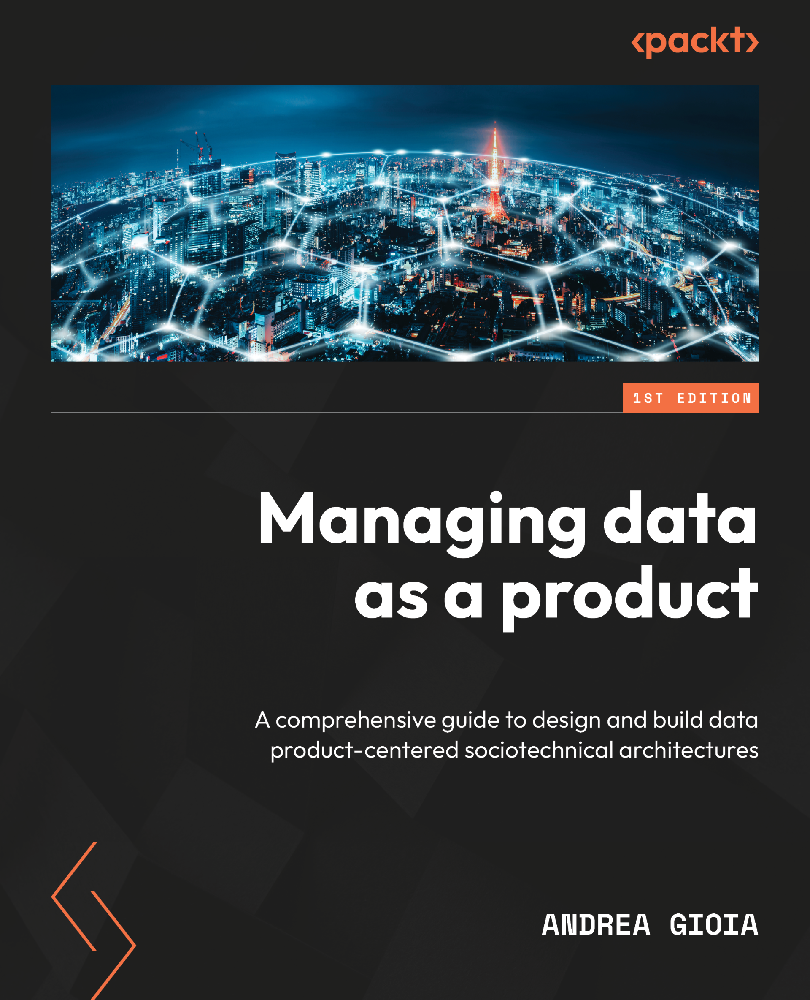

# Managing data as a product

This is the code repository for [Managing data as a product](https://amzn.eu/d/2a7Tmi1), published by Packt.

**A comprehensive guide to design and build data product-centered sociotechnical architectures**

## What is this book about?

This book covers everything you need to know to manage data as a product and shift toward a more modular and decentralized sociotechnical data architecture, capable of delivering business value in an incremental, measurable, and sustainable way. 

*Key Features:*
1. Master data-as-product concept, unlocking modular platform potential to fix flaws in traditional monolithic architectures
1. Learn to identify, implement, and operate data products throughout their life cycle
1. Gain the expertise to design and execute a successful data product-centric strategy in your organization

Here you can find the complete [OUTLINE](OUTLINE.md).

## Get to Know the Author
**Andrea Gioia** is a Partner and CTO at Quantyca, a consulting company specializing in data management. He is also a co-founder of blindata.io, a SaaS platform focused on data governance and compliance. With 20+ years of experience, he leads teams in executing complex data projects across sectors like banking, utilities, retail, and industry. As Quantyca's CTO, Andrea advises clients on data strategy, emphasizing organizational and change management issues. Actively engaged in the data community, he organizes the Data Engineering Italian Meetup, leads the Open Data Mesh Initiative, and is one of the main contributors to the data product descriptor open specification. Andrea is an active member of the scientific committee of the DAMA Italian Chapter. [More...](https://github.com/andrea-gioia) 

